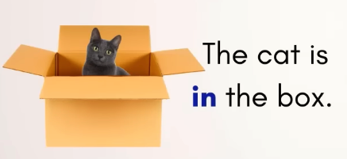

# in & into & in to & on & onto & on to 

## in/on, into/onto

1. **The location of action/object**: in / on
don't need an object. object can be optional.
2. **The change of location**: into / onto
always need an object. 

- The cat is **in** the box.
- He backflipped in the water.
- come in.

- The cat is **on** the box.
- I stepped on a jellyfish.
- We walked on the boat.

- The cat walked **into** the box.
- I moved the TV into the bedroom.
- He backflipped into the water.

- The cat jumped **onto** the box.
- She carefully placed the flowers onto the coffin.
- We walked onto the boat.

> `To` really introduces that destination.

## inside

- The cat is **inside** the box.

There is no difference with `in`.

- The milk is in the fridge.
- The milk is inside the fridge.

`inside` and `in` both show the location.

But, `inside` is used to emphasize completely covered. like a box, container, etc.
`inside` is more precise.

## exception

### in

- Come in. (there is no object)

We always use `in` with a city or country.

- This picture was token in Spain.

### into

We can talk about a **transformation** with `into`.

- A caterpillar turns into a butterfly.
- I had to translate all of these documents into English.

But there is a exception: 

We can also use `into` to speak about an **impact**.

- A bird just flew into the window.
- Cars are driven into walls to test their safety.

### on

- He walked on without his microphone.(onto the stage)

we don't need to repeat `onto the stage`, bacause it's already clear in the conversation or in the text.

### onto

- He walked onto the stage without his microphone.

### special verbs

- dive
- drop
- fall
- jump
- put
- throw

With these verbs you can use in/into or on/onto interchangeably.

- Put the ice cream in the freezer.
- Put the ice cream into the freezer.
- He threw the pizza on the roof.
- He threw the pizza onto the roof.
 

- Look in my eyes and tell me the truth.
- Look into my eyes and tell me the truth.

It's very common to interchange `look in` with `look into` for native speaker.

## in to & on to

In spoken English, It doesn't matter. They sounds the same.

This is all about written English.

- We all chipped in to buy Frankie a present.
- Try this dress on to see if it fits you.

`chip in` and `try on` are both phrasal verbs.

`to buy` and `to see` are both infinitives.

> **infinitive: to + base verb**
> In these examples, the infinitive is showing us why we do the action.

- I <ins>went out</ins> <ins>to celebrate</ins> my birthday.

> To: part of the infinitive
> To: a preposition

- The student <ins>handed</ins> his essay <ins>in</ins> <ins>to</ins> the teacher.
- Take a booklet and <ins>pass</ins> the stack <ins>on</ins> <ins>to</ins> the person sitting next to you.
- The mayor decided not to <ins>give in</ins> <ins>to</ins> the protesters' demands.

Some phrasal verbs already have `into` and `onto` as their preposition.

- [Category:English phrasal verbs with particle (into)](https://en.wiktionary.org/wiki/Category:English_phrasal_verbs_with_particle_(into))
- [Category:English phrasal verbs with particle (onto)](https://en.wiktionary.org/wiki/Category:English_phrasal_verbs_with_particle_(onto))

## words and phrases

| words and phrases | meanings ||
| --- | --- | --- |
| destination /ˌdes.təˈneɪ.ʃən/ | the place where someone is going or where something is being sent or taken. ||
| emphasize /ˈem.fə.saɪz/ | to show that something is very important or worth giving attention to; to make something more obvious. ||
| tomb /tuːm/ | a large stone structure or underground room where someone, especially an important person, is buried. ||
| precise /prəˈsaɪs/ | exact and accurate. ||
| coffin /ˈkɑː.fɪn/ | a long box in which the body of a dead person is buried or burned. ||
| backflip(-ped) | a type of somersault (= a movement in which you turn over completely) which involves turning backwards and landing on your feet. ||
| transformation /ˌtræns.fɚˈmeɪ.ʃən/ | a complete change in the appearance or character of something or someone, especially so that that thing or person is improved. ||
| caterpillar /ˈkæt̬.ɚ.pɪl.ɚ/ | a small, long animal with many legs that feeds on the leaves of plants, and develops into a butterfly or moth. ||
| exception /ɪkˈsep.ʃən/ | someone or something that is not included in a rule, group, or list or that does not behave in the expected way. ||
| impact /ˈɪm.pækt/ | the force or action of one object hitting another. ||
| fly => flew => flown |  ||
| interchangeably /ˌɪn.t̬ɚˈtʃeɪn.dʒə.bli/ | in a way that can be exchanged without making any difference or without being noticed. ||
| roof /ruːf/ | the covering that forms the top of a building, vehicle, etc. ||
| preposition /ˌprep.əˈzɪʃ.ən/ | in grammar, a word that is used before a noun, a noun phrases, or a pronoun, connecting it to another word. ||
| chip in | people pay for something together, usually a gift. | if there are five people in your office and they all chip in ten dollars, you have fifty dollars to buy someone a gift. |
| contribute /kənˈtrɪb.juːt/ | to give something, especially money, in order to provide or achieve something together with other people. ||
| phrasal /ˈfreɪ.zəl/ | forming or relating to a group of words that is part of, rather than the whole of, a sentence. ||
| try on | you put clothes on to see if they look good. ||
| infinitive /ɪnˈfɪn.ə.t̬ɪv/ | the basic form of a verb that usually follows "to" ||
| go out | to leave the house to do something fun. ||
| essay /ˈes.eɪ/ | a short piece of writing on a particular subject, especially one done by students as part of the work for a course. ||
| booklet /ˈbʊk.lət/ | a very thin book with a small number of pages and a paper cover, giving information about something. ||
| separate /ˈsep.ɚ.ət/ | existing or happening independently or in a different physical space. ||