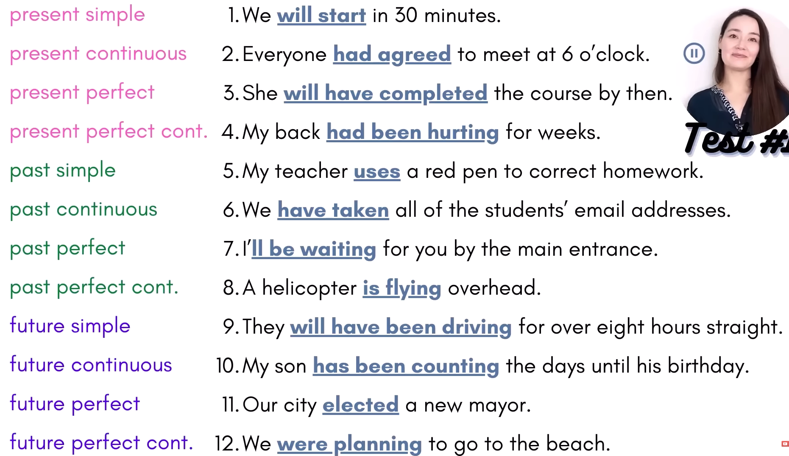
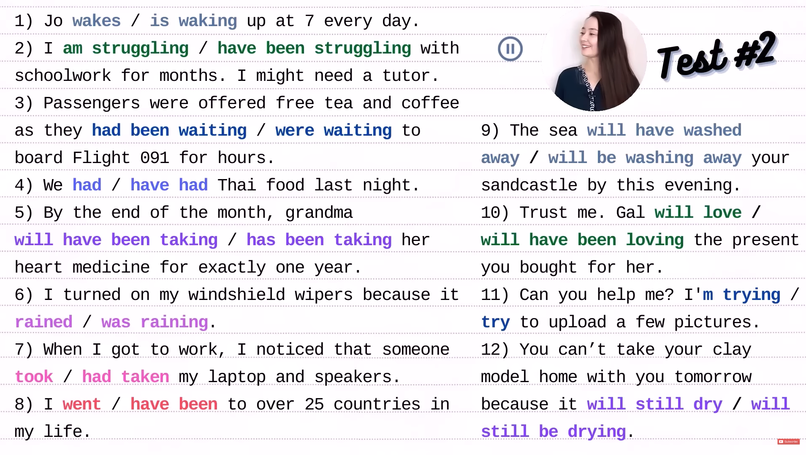

# Tenses

## The Video Link

[ALL 12 ENGLISH TENSES IN 1 HOUR! + TEST by Amel's Everyday English](https://www.youtube.com/watch?v=Qi7imPEvI3U)

## General Overview

There are three periods.

Each Tense has its own unique grammatical structure.

<!-- prettier-ignore -->
| PAST | PRESENT | FUTURE |
| --- | --- | --- |
| past simple `subject` + `past simple verb` | present simple `subject` + `base verb` | future simple `subject` + `will` + `base verb` |
| past contrnuous `subject` + `was/were` + `"ing"` | present continuous `subject` + `am/is/are` + `"ing"` | future continuous `subject` + `will be` + `"ing"` |
| past perfect `subject` + `had` + `past participle` | present perfect `subject` + `have/has` + `past participle` | future perfect `subject` + `will have` + `past participle` |
| past perfect continuous `subject` + `had been` + `"ing"` | present perfect continuous `subject` + `have/has been` + `"ing"` | future perfect continuous `subject` + `will have been` + `"ing"` |

## Grammatical Structure

### All Simple Tenses

We use simple tenses for

- habits
- repeated actions
- things that are always true like facts
- describe states
- single action, one action（No repeated actions, no states.）

A state is a **situation** or an **opinion** or a **feeling**.
States don't change often.

#### Present Simple

- I **wake up** at 6 a.m. every morning.
- I **do not wake up** at 6 a.m. every morning.
- **Do** you **wake up**at 6 a.m. every morning?
- Doug is our team leader.
- I enjoy pop music.
- I made an omelette for breakfast.

##### Special present simple

Present simple can be used for a scheduled future event.

But it's something that's scheduled, it's not something that we can control.

- My bus leaves in 10 minutes.
- Our train leaves at 9.
- The movie starts in 30 minutes.
- My classes start next week.

#### Past Simple

Present simple is already clear mean now.

But, in the context of conversation or text,
we need **a specific time** with the past simple.
we need a bit more detail.

- **When I was in high school**, I **woke up** at 6 a.m. every morning.
- I **did not wake up** at 6 a.m. every morning.
- **Did** you **wake up** at 6 a.m. every morning?
- Student did their homework online. (this would mean **now they don't**.)
- Student did their homework online **during the pandemic**, but now they don't need to.
- I had long hair **until I turned 18**. (past state and a specific time)
- **Last year**, Doug was our team leader.
- **When I was a kid**, I never eta the crust on the toast. I hated it.
- **When I was a little kid**, I had a very cute yorkie.
- I bought a new phone yesterday.

#### Future Simple

In the future simple, we also need a specific time.
we need a bit more detail.

Because we always know what's going to happen in the future, that future simple is often used for predictions and promises.

We can't use future simple for a future plan. The present continuous is the better and more natural choice.

- Starting the 15th of January, I **will wake up** at 6 a.m. every morning.
- I **will not wake up** at 6 a.m. every morning.
- **Will** you **wake up** at 6 a.m. every morning?
- Student will do their homework **beginning May**.
- **In a few years**, I will have long hair. (that will be my future state)
- **Next Week**, Doug will be our new team leader.
- **Next Year**, I will floss more.
- What will earth be like in one thousand years.
- The chef will prepare something nice for us.

### All Continuous Tenses

Continuous tenses express a **temporary** action or situation.
They are not permanent or repeated actions like the simple tenses.

The continuous tenses can be the main action, but many times with the **past continuous** and **future continuous**, they express **background action**.

These background actions are either **interrupted by a main action**, or the main action happens at **the same time**.

**[stative verb](./stative_verb_dynamic_verb.md)** is not used in continuous tenses.

#### Present Continuous

- I am talking to you.
- It's getting dark. (It doesn't get dark forever.)
- I was holding a cup of coffee on the couch when my son bumped into me.
- They're loving it! (this is casual english, but not for english exams.)

##### for a future plan

We can use the present continuous for a future plan.

We can't use future simple for a future plan. The present continuous is the better and more natural choice.

- Tomorrow we are flying to Rome.
- I'm meeting Jake and Ellen for dinner tonight.
- What are you doing this weekend?

##### present continuous & be going to for a future plan

Native speakers use both of these forms interchangeable all the time, and they are both correct.

- I'm going to meet Jake and Ellen for dinner tonight.
- I'm meeting Jake and Ellen for dinner tonight.

But, let's get super specific.

1. be going to do something is often used with a future **intention**.
2. present continuous is more **definite**.

- I'm going to stay at home and watch movies all day.
- I'm taking my students to a museum.

#### Past Continuous

we need a specific time.

- I was talking to you yesterday.
- What were you doing at 3 pm yesterday?
- Don't message me after 6. I **will be having dinner**(background action) with my boss.
- I know Keira will be loving the party.

#### Future Continuous

we need a specific time.

- I will be talking to you in 1 hour.
- What will you be doing 3 hours from now?

#### simple tenses: premanent & continuous tenses: temporary

<!-- prettier-ignore -->
| simple tenses: premanent | continuous tenses: temporary |
| --- | --- |
| I work in Tucson. | I'm working in Tucson. |
| :point_up: This is my life, this is where I live, this is where my office is. | :point_up: Maybe I normally work in Mesa, a different city, but for two weeks I'm working in Tucson. |
| I worked in Tucson. | I was working in Tucson.  |
| :point_up: This was my life,... | :point_up: I couldn't go to the office party because I was working in Tucson, last week. |
| I will work in Tucson. | I will be working in Tucson. |
| :point_up: This will be my new futrue life, ... | :point_up: I will be working in Tucson, temporarily. |

The continuous tenses express a temporary action during a specific period.

- I'm studying now.
- I was studying this morning.
- I will be studying tonight.

### All Perfect Tenses

Perfect tenses emphasize an action before something else.

1. **Past perfect** before **another past point**;
   There is a connection between the past action and the present.
2. **Present perfect** before **now**;
3. **Future perfect** before **another future point**;

#### Present Perfect

> subject + have/has + past participle

- I have (not) eaten at Rosario's
- Have you eaten at Rosario's
- I have been to Paris. (before the present)
  Maybe I'm having a coffee break at work and one of my colleagues keeps talking and talking about her trip to Paris. And she says to me: Nansen, you have to go to Paris, you need to go to Paris.
  I can say I have been there, I have been to Paris. In fact, I have been there three times. So you can stop talking your trip now.
  I'm **emphasizing before now** I have been there.

- He has finished his homework.
  Dad: Is it okay that Louis is playing video games?
  Mom: Yeah, he has finished his homework.
  We don't care about specifically when, but relevant the present. His past action means now he can play video games.

- Kim has taken the TOEFL exam. (before the present)
- What is something that you have done that you are proud of?
- I have taught the present perfect many times.
- I have been a teacher for 10 years.

##### if the action started in the past and is still true now

- Jane has lived in Canada **for 22 years**.
- I have had stort hair **my entire life**.
- They have known each other **since kindergarden**.

for 22 years & my entire life & since kindergarden, these tell us **how long**.
There is a connection between the past and the present.
The situations are still true today.

Common mistakes:

- :x: Jane is living in Canada for 22 years.
- :x: Jane lives in Canada for 22 years.

##### past simple & present perfect

The present perfect is more **general**, we are interested in **what happened** in your past experience.

The past simple is more **specific** and we need to know **specifically when**.

- I have been to Paris.
- I went Paris in 2020.
- Kim has taken the TOEFL exam.
- Kim took the TOEFL exam last week.
- My parents have seen my new house.
- My parents saw my new house on Monday.
- He has finished his homework.
- He finished his homework an hour ago.
- Mary Smith (who is no longer alive) had long hair her entire life.

The present perfect is very common in interviews. Because the interviewer is interested in your experience, not specifically when things happened.

#### Past Perfect

> subject + had + past participle

**An action completed before another past point**.
The past perfect can also show **a past to past connection**.

- I had been to Paris **before I started university**.
  I added a past simple to make another past point.
- **By the time I moved all of my furniture into my new house**, my parents had already seen it.
  Even though the past perfect comes second in the sentence, it's still clear it happened before that past simple action.
- Jane was sad to move because she had lived in Canada for 22 years.
- I had had long hair my entire life, and it was really diffcult for me to cut it.
  had: the past participle of have
- What is something that you had done before you turned 18?
- When I completed my teacher training course, I had not taught present prefect at all.
- By 2011, I had been a teacher for only one year.

#### Future Perfect

> subject + will have + past participle

A completed action before a future point.
An action that continues up to another future point.

- **By the end of the summer** (the future point), you will have been to France, Germany and Spain (what will have happened before the future point).
- **In a few days**, She **will have finished her TOEFL exam**.
- I wanted to surprise my parents by showing them my new house. But, **by the time I show them**, they **will have** already **seen** it on Instagram.
- **By 2025**, She **will have lived** in Canada for 22 years.
- I hired him on my birthday, so **on my next birthday**, he **will have been** with me for eight years.
- What is something that you will have done by the time you turn 100?
- By the time I turn 40, I will have taught the present perfect many times.
- In nine years, I will have been a teacher for half of my life.

##### future simple & future perfect

future perfect: completed before a future point or continued up to a future point.

future simple: the future simple doesn't depend on anything in the future. it's just when something will happen.

### All Perfect Continuous Tenses

The perfect continuous tenses emphasize an action that **continues up to another point**.

Usually, these actions are ongoing or they end **very close to the other point**.

And the emphasis is on **duration**, how long.

#### Present Perfect Continuous

An action started in the past, it continues up to the present or another past point, and it **is ongoing**.

- The pie has been baking for 20 minutes and the kitchen smells wonderful.
- Has the pie been baking.
- It has been raining non-stop.
- The river burst its banks as it had been pouring for days.
  You can see that present perfect continuous action continued up to the past point and was probably ongoing.

The action could be ongoing or the action could have **stopped just before the present time**.

- Sorry, I'm sweaty. I've been running.

##### perfect continuous & perfect simple (able to be used for the present, the past and the future. )

How long is important in the present perfect and the present perfect continuous.

[Grammar Web - What's the different between the present perfect and present perfect continuous?](./assets/flowChart/GrammarWeb.xmind)

##### some verbs that are dynamic and stative

The two verbs **live and work** are dynamic and stative.
Where we live or work is not change often.

We can use these two verbs live and work interchangeably with **the present perfect** and **the present perfect continuous**.
There is no differences in meaning.

- Jane has been working at this school for 3 years.
- My mom has been living in Sinan **for as long sa I can remember**.

Some people maybe will choose the present perfect continuous to emphasize the duration.

#### Past Perfect Continuous

We use **had been** for all subjects.

An action continues up to another past point.

- The pie had been baking.
- Had the pie been baking.

- By the time I performed the song, I had been practicing for months.

#### Future Perfect Continuous

We use **will have been** for all subjects.

The future perfect continuous ongoing action could have started in the past, the present or the future.
It really depends on the situation.

The future perfect continuous tense is the least common tense in English.
It's not really heard in spoken English.

- The news say that it's going to rain for nother three days.
- By Friday, it will have been raining for eight days.
   

- How are your solar panels holding up / surviving?
- Great. Next month, they will have been providing us energy for exactly one year.

At the end of July, America's economy will have been growing for 121 months. (written English)

#### homework

- What is something you have been doing recently? and you will probably continue to do.
- I've been learning English.
   

- What is something you had been doing before the pandemic to improve your English?
   

- By the end of this year, what will you have been doing to improve your English?

## Compare

<!-- prettier-ignore -->
| Tense | Examples | Explain |
| --- | --- | --- |
| **Present Perfect Continuous** | The pie **has been baking** for 20 minutes and the kitchen smells wonderful. | An action starts in the past, it continues up to the present, and is ongoing. |
| **Present Perfect** | The pie **has baked**, cooled and is now ready to cut. | When did the action happen, it doesn't matter. just before now. |
| **Past Simple** | The pie baked beautifully **yesterday** and everyone enjoyed it. |  |
| **Present Continuous** | The pie is baking now, don't turn off the oven. | I'm focusing on the action now. |

<!-- prettier-ignore -->
| Tense | Examples | Explain |
| --- | --- | --- |
| **Past Perfect Continuous** | When I checked on the pie it had been baking for 20 minutes. | |
| **Past Perfect** | By the time I took the pie out of the oven, its crust had turned golden brown. | |
| **Past Simple** | The other day I was really in the mood to do some baking, so I baked a pie. | the other day means the past, maybe two, three days ago. the past simple is not dependent on another past point. |
| **Past Continuous** | The pie was baking in the oven, when we had a power cut. | the past continuous is giving me the background, the background action that was interrupted by another. |

## TEST

TEST 1:

TEST 2:

## Some Words and Phrases

<!-- prettier-ignore -->
| Words and Phrases | Meanings ||
| ---- | --- | --- |
| build a really strong foundation |||
| foundation | the structures below the surface of the ground that support a building ||
| bare infinitive | in grammar, the infinitive form of a verb without the word "to" ||
| keep something in mind | to remember something, especially something that will be important in the future. ||
| negative | expressing "no"; A negative sentence or phrase is one that contains a word such as "not", "no", "never", or "nothing". ||
| specific /spəˈsɪf.ɪk/ | relating to one thing and not others; particular; clear and exact. ||
| at a specific time |  ||
| pandemic /pænˈdem.ɪk/ | (of a disease) existing in almost all of an area or in almost all of a group of people, animals, or plants ||
| situation /ˌsɪtʃ.uˈeɪ.ʃən/ | the set of things that are happening and the conditions that exist at a particular time and place. ||
| opinion /əˈpɪn.jən/ | a thought or belief about something or someone. ||
| floss /flɑːs/ | to clean between your teeth using dental floss ||
| yorkie | yorkie is a short name for Yorkshire Terrier. ||
| omelette /ˈɑː.mə.lət/ | a dish made by mixing eggs together and frying them, often with small pieces of other food such as cheese or vegetables. ||
| permanent /ˈpɝː.mə.nənt/ | lasting for a long time or for ever; ||
| temporary /ˈtem.pə.rer.i/ | not lasting or needed for very long. ||
| term /tɝːm/ | [noun TIME] the fixed period of time that something lasts for. ||
| addition | the process of adding numbers or amounts together. ||
| subtraction /səbˈtræk.ʃən/ | the process of removing one number from another. ||
| elementary | basic; relating to the early stages of studying a subject. ||
| bump /bʌmp/ | to hit something with force. ||
| combination /ˌkɑːm.bəˈneɪ.ʃən/ | the mixture you get when two or more things are combined. ||
| stative verb | stative verb describe a state rather than an action. These can be our **feelings**, our **thoughts**, and our **emotions**.||
| interchangeable /ˌɪn.t̬ɚˈtʃeɪn.dʒə.bəl/ | able to be exchanged with each other without making any difference or without being noticed. ||
| intention | something that you want and plan to do. ||
| definite /ˈdef.ən.ət/ | fixed, certain, or clean. something that is certain to happen. ||
| interrupt /ˌɪn.t̬əˈrʌpt/ | to stop a person from speaking for a short period by something you say or do; to stop something from happening for a short period. ||
| either /ˈiː.ðɚ/ /ˈaɪ.ðɚ/ | used in negative sentences instead of "also" or "too". ||
| participle /ˈpɑːr.tɪ.sɪ.pəl/ | the form of a verb that usually ends in "ed" or "ing" and is used as an adjective. ||
| emphasize /ˈem.fə.saɪz/ | to show that something is very important or worth giving attention to; to make something more obvious. ||
| emphasis /ˈem.fə.sɪs/ | [noun] the particular importance or attention that is given to something. ||
| relevant /ˈrel.ə.vənt/ | connected with what is happening or being discussed; correct or suitable for a particular purpose. ||
| colleague /ˈkɑː.liːɡ/ | one of a group of people who work together. ||
| general /ˈdʒen.ər.əl/ | involving or relating to most or all people, things, or places, especially when these are considered as a unit. ||
| kindergarden | refers to a form of early childhood education. kindergarden isn't a real word in English. It's just a common misspelling that makes your writing look less professional or harder to understand. ||
| by the time | at or before the moment some event happens. ||
| detective /dɪˈtek.tɪv/ | someone whose job is to discover information about crimes and find out who is responsible for them. ||
| suspect /səˈspekt/ | to think or believe something to be true or probable. ||
| bake /beɪk/ | to cook inside an oven, without using added liquid or fat. ||
| duration /duːˈreɪ.ʃən/ | the length of time that something lasts. ||
| evidence /ˈev.ə.dəns/ | one or more reasons for believing that something is or is not true. ||
| oven /ˈʌv.ən/ | the part of a cooker with a door, used to bake or roast food. ||
| slightly /ˈslaɪt.li/ | a little ||
| burst /bɝːst/ | to break open or apart suddenly, or to make something do this. ||
| bank /bæŋk/ | sloping raised land, especially along the sides of a river. ||
| be let go | be fired ||
| solar panel /ˌsoʊ.lɚ ˈpæn.əl/ | a device that changes energy from the sun into electricity. ||

## the answer

